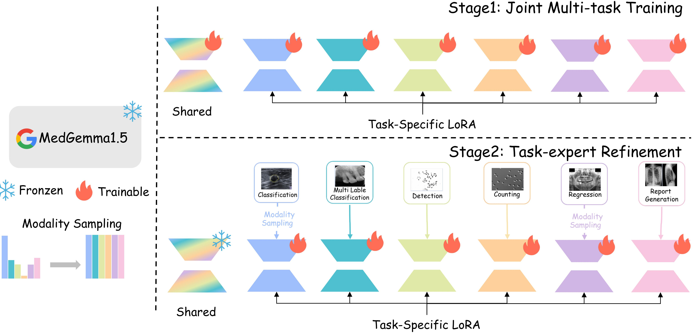
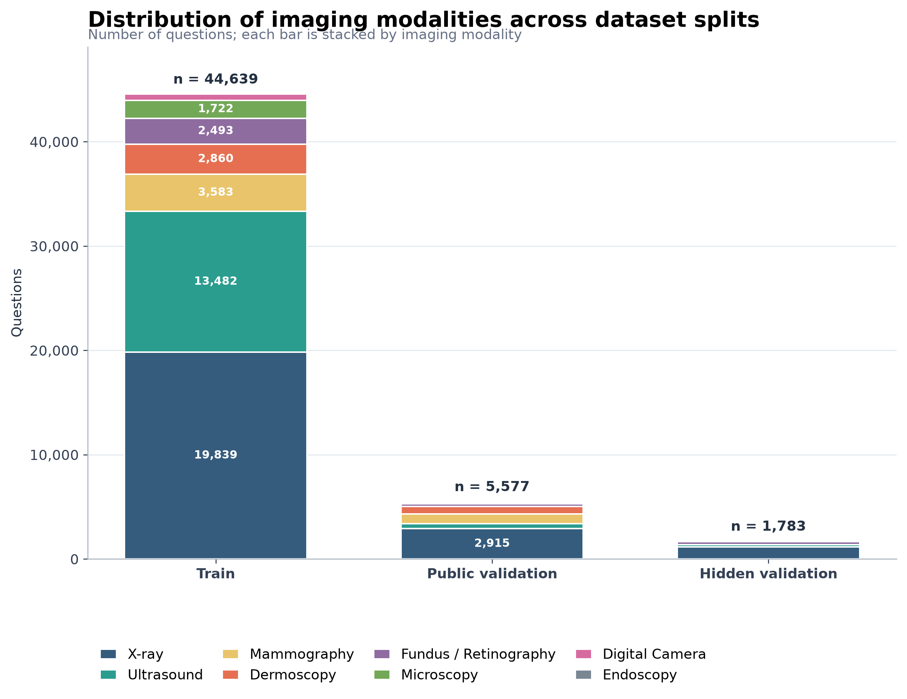
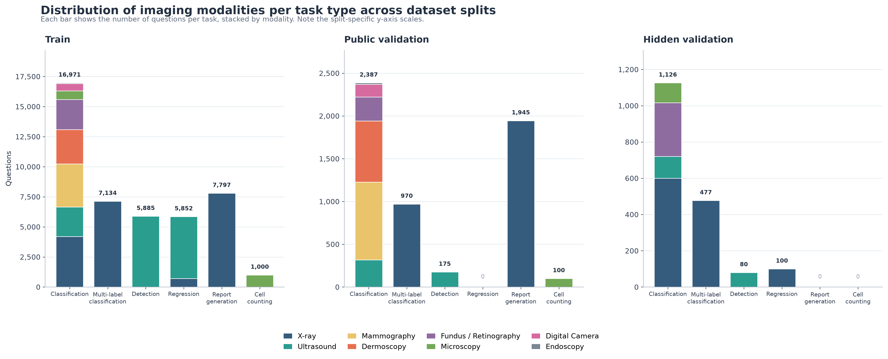
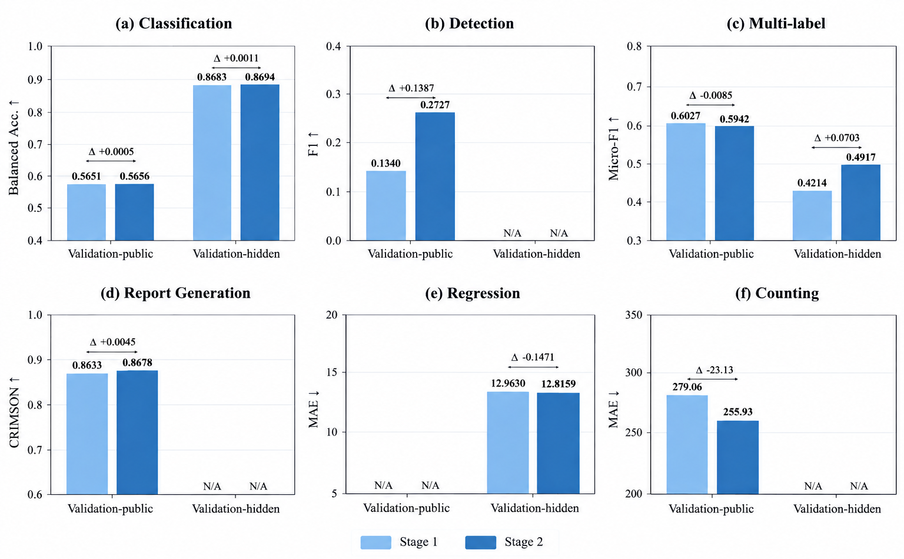
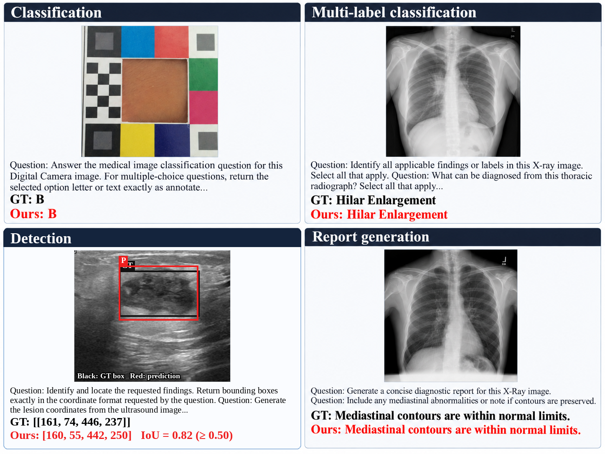

# Two-Stage Mixture-of-LoRA for Medical VLMs

<p align="center">
  <b>LIST-SEU submission for MICCAI FLARE 2026 Task 3-2D: Medical Image Understanding</b><br>
  A single MedGemma-1.5-4B-IT backbone with a shared LoRA and six task-specific experts.
</p>

<p align="center">
  <a href="https://benny0323.github.io">Zhanghao Chen</a><sup>*</sup>, Yuanyuan Li<sup>*</sup>, Zhenyu Lu<sup>*</sup>, Shuo Gao,<br>
  Guangquan Zhou<sup>†</sup>, and Yikun Zhang<sup>†</sup><br>
  Southeast University, Nanjing, China<br>
  <sup>*</sup>Equal contribution &nbsp; <sup>†</sup>Corresponding authors
</p>

<p align="center">
  <a href="https://huggingface.co/BennyZhanghaoChan/Task3-2D-LIST-SEU-Zhanghao_Chen-Testing_Submission"></a>
  <a href="https://github.com/YuanYL03/MICCAI-FLARE-2026-Challenge-Task3-2D#quick-start"></a>
  <a href="https://github.com/YuanYL03/MICCAI-FLARE-2026-Challenge-Task3-2D#method"></a>
  <a href="https://github.com/YuanYL03/MICCAI-FLARE-2026-Challenge-Task3-2D#validation-results"></a>
</p>

## Overview

This repository releases the inference implementation for our FLARE 2026 Task 3-2D submission. The system uses **MedGemma-1.5-4B-IT** as the only vision-language backbone and supports all six benchmark tasks:

| Task | Output |
|---|---|
| Disease diagnosis classification | Class label |
| Multi-label classification | One or more findings |
| Detection | Bounding-box coordinates |
| Cell counting | Numeric count |
| Regression | Numeric value |
| Report generation | Free-text report |

Download the model adapter from [Hugging Face](https://huggingface.co/BennyZhanghaoChan/Task3-2D-LIST-SEU-Zhanghao_Chen-Testing_Submission) before running inference.

## Method

The model augments a frozen MedGemma backbone with one **shared LoRA** and six **task-specific LoRA experts**. At inference time, the shared adapter and the expert matching the known task identity are activated together. The shared adapter carries reusable cross-task image--language knowledge, while each expert specializes in its own visual cues and output format.

Training follows the two-stage procedure described in the paper. Stage 1 jointly optimizes the shared adapter and all six experts for five epochs. In Stage 2, every expert is refined independently while the backbone, shared adapter, and non-target experts remain frozen. The six expert refinements run for 3, 5, 8, 3, 8, and 3 epochs for classification, detection, multi-label classification, report generation, counting, and regression, respectively. Classification and regression then receive a short three-epoch modality-balanced continuation: smaller modality groups are repeated so that every group has equal exposure in an epoch.

<p align="center">
  
</p>

## Dataset composition

FLARE-MLLM-2D contains heterogeneous tasks and imaging modalities. The train, public-validation, and hidden-validation splits contain 44,639, 5,577, and 1,783 image--instruction--answer instances, respectively. Modality and task composition vary across splits; in particular, public validation has no regression labels, while hidden validation has no report-generation or cell-counting labels. We therefore use task-wise checkpoint selection rather than a single aggregate score.

<p align="center">
  
</p>

<p align="center">
  
</p>

## Validation results

The table below reports validation-public | validation-hidden. `N/A` denotes a split without labels for that task. Higher is better except for MAE.

| Task | Metric | MedGemma-1.5-4B (base) | Ours |
|:---:|:---:|:---:|:---:|
| Classification | Balanced accuracy ↑ | 0.5547 \| 0.7831 | **0.5656 \| 0.8694** |
| Detection | F1, IoU > 0.5 ↑ | 0.2005 \| 0.0265 | **0.2727 \| N/A** |
| Multi-label classification | Micro-F1 ↑ | 0.6075 \| 0.4449 | 0.5942 \| **0.4917** |
| Report generation | CRIMSON ↑ | 0.8561 \| N/A | **0.8678 \| N/A** |
| Regression | MAE ↓ | N/A \| 15.5031 | N/A \| **12.8159** |
| Cell counting | MAE ↓ | 275.64 \| N/A | **255.93 \| N/A** |

Expert-wise refinement improves detection, counting, multi-label classification, regression, and report generation relative to the joint Mixture-of-LoRA checkpoint. Modality-balanced continuation further improves the targeted classification and regression experts, from 0.8683 to 0.8694 hidden balanced accuracy and from 12.8853 to 12.8159 hidden MAE, respectively.

<p align="center">
  
</p>

### Official testing results

On the official testing set, the released submission obtains the following scores:

| Detection F1 ↑ | Classification balanced accuracy ↑ | Multi-label Micro-F1 ↑ | Regression MAE ↓ |
|:---:|:---:|:---:|:---:|
| **0.7917** | **0.8507** | **0.4809** | **17.3954** |

## Qualitative examples

Representative validation examples show correct classification and multi-label predictions, a detection example where coordinate deviation reduces IoU, and a report-generation example. Ground truth is shown in black and the model prediction in red.

<p align="center">
  
</p>

## Quick start

### 1. Clone and create an environment

```bash
git clone https://github.com/YuanYL03/MICCAI-FLARE-2026-Challenge-Task3-2D.git
cd MICCAI-FLARE-2026-Challenge-Task3-2D

conda create -n flare26-medgemma python=3.11 -y
conda activate flare26-medgemma

# Install a CUDA-compatible PyTorch build first; choose the command for your CUDA version from pytorch.org.
pip install torch torchvision
pip install -r inference/requirements.txt
```

The released inference environment was validated with `transformers==5.14.1`, `peft==0.19.1`, `accelerate==1.14.0`, BF16 inference, and one image per sample.

### 2. Download the base model and adapter bundle

Accept the MedGemma license on Hugging Face before downloading the base model. Then download both model directories locally:

```bash
# Base model (requires accepted MedGemma access terms)
huggingface-cli download google/medgemma-1.5-4b-it \
  --local-dir checkpoints/medgemma-1.5-4b-it

# Shared adapter, six task experts, tokenizer, and processor files
huggingface-cli download BennyZhanghaoChan/Task3-2D-LIST-SEU-Zhanghao_Chen-Testing_Submission \
  --local-dir checkpoints/medgemma-best-0828
```

The adapter directory must contain the root `adapter_model.safetensors`, six `expert_*` directories, and the optional task-specific shared-adapter snapshots included in the released bundle.

### 3. Run inference on raw FLARE data

The script reads the original FLARE JSON files and images recursively from `--data_root`; no preprocessing JSONL is required. It writes a submission-format `predictions.json`, a resumable JSONL prediction log, and `inference_details.json`.

```bash
bash inference/run_inference.sh \
  --data_root /path/to/FLARE_Test \
  --model_base checkpoints/medgemma-1.5-4b-it \
  --adapter_path checkpoints/medgemma-best-0828 \
  --output_dir outputs/testing \
  --split_name testing \
  --device cuda \
  --image_size 896 \
  --max_images 1 \
  --max_new_tokens 256 \
  --temperature 0
```

The expected input tree can be mounted or passed directly as `/path/to/FLARE_Test`; it does not need an additional `testing/` subdirectory. The final submission file is:

```text
outputs/testing/predictions.json
```

Use `--resume` to continue an interrupted run. Add `--load_4bit` only when GPU memory is insufficient; the released results use BF16 rather than 4-bit loading.

## Repository layout

```text
.
├── inference/
│   ├── infer_task3_medgemma15.py  # Raw-FLARE inference and submission writer
│   ├── run_inference.sh           # Convenient launcher
│   ├── requirements.txt           # Validated Python dependencies
│   └── mle/                       # Model loading, routing, preprocessing, and decoding utilities
├── assets/                        # Method, distribution, result, and qualitative figures
├── LICENSE
└── README.md
```

## Reproducibility notes

- Inference is greedy (`temperature=0`) and runs one sample at a time to preserve task-specific adapter routing.
- The model uses a square `896 × 896` resize and supports one image per instance in the released configuration.
- The default script works offline after the base model and adapter bundle have been downloaded locally.
- This code is intended for research and FLARE-format inference only; it is not a clinical decision-support system.

## Acknowledgements

We thank the FLARE 2026 challenge organizers and data contributors. This work builds on [MedGemma](https://ai.google.dev/gemma/docs/medgemma) and the Hugging Face ecosystem.

## License

This repository is released under the [Apache License 2.0](LICENSE). The MedGemma base model and the released adapter weights remain subject to their respective upstream terms and licenses.
